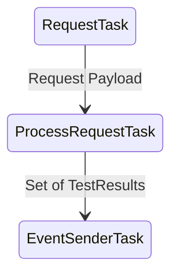

# Framework Architecture Overview

Welcome to the Observability Agents framework (henceforth, the "framework").

## Purpose

This document is intended to introduce the organization and concepts central to the framework. This is a good place to start for understanding high level concepts.

## Framework Overview

The Observability Agent Framework is a set of guide rails and tools for building production-grade integration agents. It also contains general purpose tools and helpers for interacting with Observability outside agent-specific workflows.

You can use this framework for the following:

* To build agents
* To build observability integrations
* To write one-off observability scripts

## Organization

The framework is split into three pieces.

* The `framework` module. This module contains skeletons, functions, and building blocks for construction asynchronous agents. Tasks, Loops, Handles, etc.
* The `toolkit` module. These are more helper functions and components for building scripts and programs around Observability, including but not exclusively agents.
* The `testlib` module. These are pytest fixtures and tools to help the user write tests against the framework.

Other modules are assumed to be agent-implementations (e.g., databricks), or tests.

### Agent module organization

Agents-specific functionality is organized into their own modules. For example, An airflow agent will live in `airflow`. An agent module is expected to implement an asynchronous `main` and a subclass of the `BaseSettings` class with a `model_config` member.

See the following for more details.

* [tutorial](writing-an-agent.md)

## Concepts

The following is a list of concepts that will be useful in understanding before you write framework agents.

### Asynchronous

The `framework` module follows the asynchronous programming paradigm.

When an asynchronous program hits a checkpoint or function that blocks execution (signaled by the `await` keyword), it can efficiently switch to another line of execution until the previous function unblocks. This is very efficient for programs that block on I/O (like web requests) without the shared memory headaches of threads, and allows the agents to potentially run multiple paths of execution that are periodic, or event driven.

In particular, we use the `trio` library for implementing asynchronous agents. We'll expand more on this in Tasks.

Here are some useful resources. The Trio design document is especially important.

* [An introduction to asynchronous programming](https://www.bmc.com/blogs/asynchronous-programming/)
* [Trio core documentation](https://trio.readthedocs.io/en/stable/)
* [Trio Design](https://trio.readthedocs.io/en/stable/)
* [Trio Helpers](https://trio-util.readthedocs.io/en/latest/#)
* [Trio Testing](https://pytest-trio.readthedocs.io/en/stable/index.html)

NOTE: Functionality in `toolkit` is expected to support both synchronous and asynchronous modes.

### Handles

Handles are distinct blocks of functionality. Making a request to an API, processing a piece of data, etc. It's expected your Task might have several handles.

### Tasks

`Tasks` orchestrate handles and communicate data to the next stage of the process. They manage resources (sockets, etc) that live for handles that life longer than the handle itself.

Since tasks can be linked together, A task can be thought of as a node in a pipeline or graph. It may take in input from one task, and send it to another so that processing can happen asynchronously. That's because when one task pauses, or blocks, another is allowed to start up.

Consider the following diagram:

`RequestTask` is a task that makes web requests. It forwards the payloads to `ProcessRequestTask`, which may collect and process the requests. `EventSenderTask` then sends consumes the result of ProcessRequestTask and sends it to Observability.

These tasks are linked together with `Channels`.

Tasks are wrapped in loops to give them input and make them repeatable. Some loops are periodic, some

### Channels

[Channels](https://trio.readthedocs.io/en/stable/reference-core.html#using-channels-to-pass-values-between-tasks) are Trio's implementation of [Queues](https://en.wikipedia.org/wiki/Queue_(abstract_data_type\)). They are created as an enqueue and dequeue pair. You "send" into one direction, and "receive" out from the other. We use them to glue tasks together.

Be careful to not overthink them.

Some important notes with channels:

* `receive()`'ing from an empty channel is a blocking action; therefore you should not have more than one receiving channel in your task.
* `send`() on a full channel is a blocking action.
* Channels are single-consumer. The value is removed from the channel after it is read once.
* Tasks are expected to manage the life-time of their channel. That means the Task is responsible for closing their end.

That third point is as easy as ensuring you implement an `__aenter__/__aexit__` for your task. See the tutorial for details.

See

### Loops

A task without a loop will execute once and then retire. This is useful for one-off startup tasks, but not for long-running agents. A loop then orchestrates a task.

So, your task will need to be wrapped in a loop.

The framework provides two loops out of the box:

* `framework.core.loops.periodic_loop`
* `framework.core.loops.channel_receive_loop`

`periodic_loop` loops following a monotonic clock. Use this when you want your task to be periodic, or work with a time-window.

`channel_receive_loop` blocks on a channel that is given to the task. Use this for tasks that feed off other tasks.

### Configuration

The framework has tools for sourcing configurations.

Configuration completeness and type-correctness is checked during startup. There are two mixable methods that the agents use to populate configuration.

1. An `agent.toml` file (mounted into the image)
2. Environment variables under the `DK_` and `DK_<agent-type>_` namespace

This is implemented by subclassing the `BaseSettings` class and having a `model_config` member. This will be covered in more detail in the tutorial.

For more on this subject, see:

* [Pydantic Settings](https://docs.pydantic.dev/latest/concepts/pydantic_settings/) for the underlying tool.
* [Pydantic Types](https://docs.pydantic.dev/latest/concepts/types/) for the available types
* `framework/configuration/rest.py` for an example.

[Next step: Tutorial](writing-an-agent.md)
